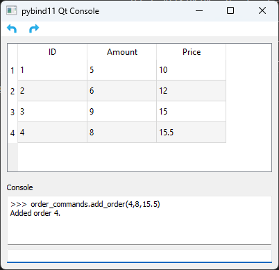

# pybind11 Qt Console with LLM Chat

## Overview

This project is a demonstration that seamlessly integrates a Python console into a Qt application using the pybind11 library, while also featuring an LLM (Large Language Model) chat interface. The Python console offers simple auto-completion and script recording functionality. The LLM chat provides an AI assistant that can understand and execute application operations, enhancing user interaction and productivity. Both the Python console and LLM chat are fully integrated with an undo/redo framework.



## Features

* Python Console Integration: Incorporate a Python console into your Qt application, enabling direct interaction with Python code.
* LLM Chat Interface: Interact with an AI assistant using a chat-like interface.
* Undo/Redo Framework: Support reverting and restoring changes.
* Operation Recording: Capture and record user interactions with the UI, enabling convenient playback and analysis of scripts.
* MIT License for easy integration into your own projects.

## Structure

The project is organized into several key components:

* **src/core**: Contains the core data model and command classes.
* **src/pythonEmbedding**: Handles the Python console integration.
* **src/LLMChat**: Implements the LLM chat functionality.
* **src/gui**: Contains the main GUI components.

The communication bridge between Python scripts and C++ code is built in the **pythonCommands.cpp** file. It defines the available Python modules and methods using pybind11 embedding functions, facilitating easy interaction between Python and C++ functionalities.

## Usage
1. Prepare pybind11 environment

    Set up a Python virtual environment, naming it **pybind11-env**.
    ```bash
    python -m venv pybind11-env
    ```
    After the virtual environment is created, you can activate it. On Windows, you can activate it with:
    ```bash
    .\pybind11-env\Scripts\activate
    ```
    After activation, use the following command to install the necessary package:
    ```bash
    pip install -r requirements.txt
    ```

2. Setup OpenAI API key

    For LLM Chat functionality, add your OpenAI API key to the `OPENAI_API_KEY` environment variable.


3. Configure CMakePresets.json

    * Update the `Qt5_DIR` and `Qt5_BIN_DIR` values in `CMakePresets.json` to match your Qt installation path.
    * Add `CMAKE_TOOLCHAIN_FILE` to the `cacheVariables` section in `CMakePresets.json`:
      ```json
      "CMAKE_TOOLCHAIN_FILE": {
          "type": "PATH",
          "value": "path/to/your/vcpkg.cmake"
      }
      ```
      Replace `path/to/your/vcpkg.cmake` with the actual path to your `vcpkg.cmake` file. This enables vcpkg to manage the curl library dependency.


4. Build project

    Build the project with the following commands:

    ```bash
    cmake --preset MSVC_x64-release
    cmake --build --preset MSVC_x64-release
    cmake --install build/release/MSVC_x64-release
    ``` 

5. Find the executable under the **bin** folder.

## License
This project is licensed under the MIT License - see the [LICENSE](https://opensource.org/license/mit/) file for details.

## Contributions
Contributions to this project are welcome. Please feel free to submit issues or pull requests to improve the functionality or fix any bugs.

## Reference
1. [Qt Completer](https://doc.qt.io/qt-5/qtwidgets-tools-customcompleter-example.html)
2. [avogadro pythonterminal.cpp](https://github.com/cryos/avogadro/blob/master/libavogadro/src/extensions/pythonterminal.cpp)
3. [pybind11: Embedding the interpreter](https://pybind11.readthedocs.io/en/latest/advanced/embedding.html)
4. [QPyConsole](https://github.com/roozbehg/QPyConsole)
5. [Creating a Scripting Engine with pybind11. Step by step.](https://github.com/aoloe/cpp-pybind11-playground)
6. [QtCpp-PythonConsole](https://github.com/kaiware0x/QtCpp-PythonConsole)
7. [QGIS/python/console](https://github.com/qgis/QGIS/tree/master/python/console)
8. [A Qt Console for IPython](https://ipython.org/ipython-doc/dev/interactive/qtconsole.html)
9. [openai-cpp](https://github.com/olrea/openai-cpp)
10. [OpenAI API - Function Calling](https://platform.openai.com/docs/guides/function-calling)